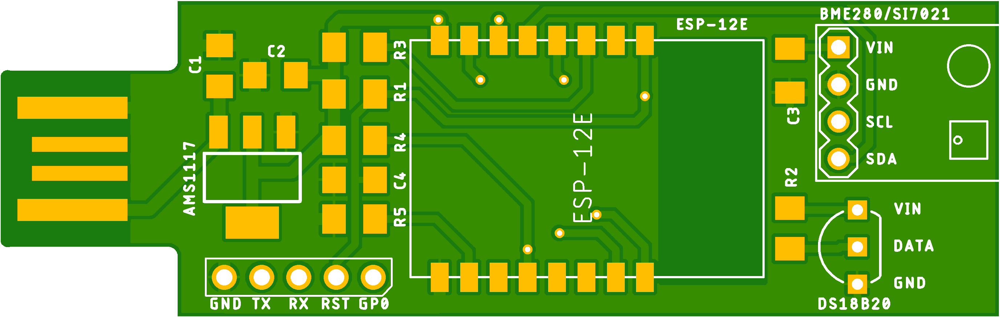
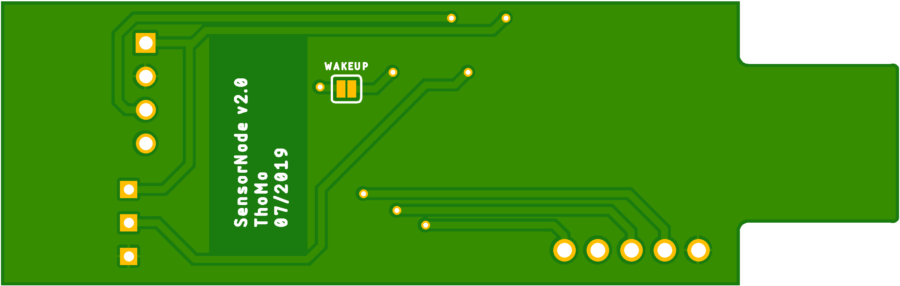
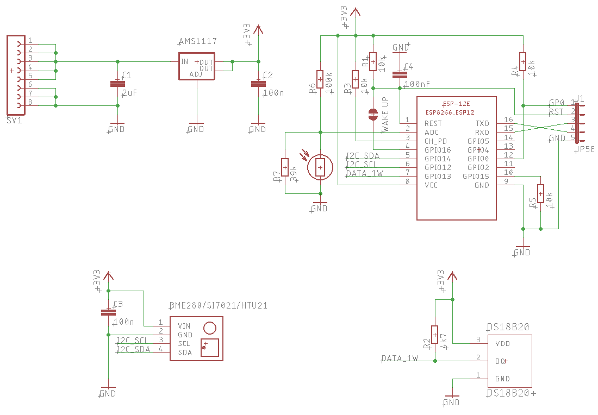
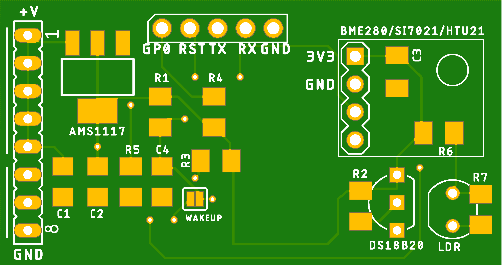
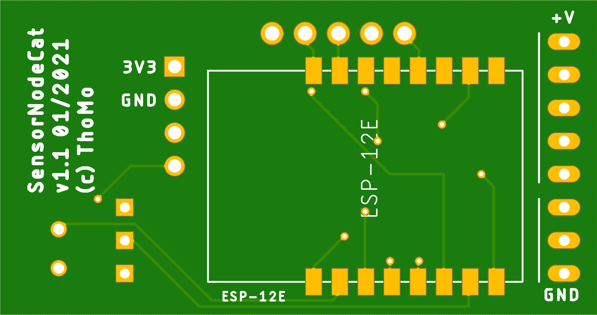

# SensorNode

A ESP8266 based solution with support for

- DS18B20 1-Wire temperature sensor
- BME280 humidity, pressure, temperature sensor (I2C) - Note: temperature is measured in-chip, so it is usually too inaccurate to measure the environment temperature
- Si7021 humidity, temperatur sensor (I2C)
- HTU21 humidity, temperatur sensor (I2C)
- LDR sensors to "measure" the brightness (analog)

The software will determine which sensors are connected. Because of the fixed I2C addresses on the sensors only one example of BME, Si7021, or HTU21 can be connected - but multiple different. Multiple 1-Wire sensors are supported. In total the number of sensors is set to 10 (`main.cpp`__MAX_SENSORS__) - but please note that each measurand counts, e.g. a BME280 counts 3x.

The software provides an configuration web page where the sensors can be enabled and an location can be specified.

The ESP will than read the sensors every 10 seconds (can be changed in ~~`main.cpp` __FETCH_SENSORS_CYCLE_SEC__~~ config dialog). The values are published via MQTT (`main.cpp` __MQTT_SERVER__). The used MQTT topic can be configured by the configuration web page (see below).

## Compile time configuration

There are some values which are only configureable on compile time (in `main.cpp`).

- DEFAULT_NODE_NAME (= F42-NODE) - used as WiFi SSID
- MQTT_SERVER (= mqtt.thomo.de) - the MQTT server, you will have to use your own :wink:
- ~~ALTITUDE (= 282.0F) - your local altitude in meters, used to adjust the pressure measurement~~ (configurable in the config dialog)
- DEFAULT_ROOT_TOPIC (= "tmp") - the standard root topic
- ~~FETCH_SENSORS_CYCLE_SEC (= 10) - fetch the sensor values every 10 seconds~~
- MAX_SENSORS (= 10) - number of supported sensors

## Runtime configuration

The runtime configuration is done by using a configuration web page served by the node. Just enter *`http://<node-ip>`*.

The config dialog allows you to enable/disable (aka activate) the connected sensors, only active sensor values are MQTT published.
For each sensor a location can be defined and a correction value. The correction value is add/sub from the sensor value and is used to calibrate the sensor.

*Note:* The displayed sensor value and the value published at MQTT already include the correction value.

## API

The Sensor Node offers some URIs

- `http://<node-ip>/config` - the node name, root topic, altitude, and display flag, as JSON data
- `http://<node-ip>/sensors` - the sensor data, as JSON

## MQTT Topic and Payload

The node will acquire the sensor measurements every X seconds - wether or not the sensor is enabled. It will than publish the value to the MQTT server with:

- topic: `<root topic>/<location>` - where each dot '.' in the root topic and in location is replaced by a slash.
  
  E.g.: with root topic *homebase* and sensor location *ground.kitchen* the resulting topic is `homebase/ground/kitchen`.
- payload: `<measurand>,location=<sensor location>,node=<node name>,sensor=<sensor type> value=<sensor value>`

  E.g.: for the selected DS18B20 sensor above the payload is `temperature,location=upstairs.workroom,node=f42,sensor=DS18B20 value=25.25`

## Circuit and PCB designs

### Sensors

- I2C Sensors
  - SDA -> GPIO4 (D2)
  - SCL -> GPIO5 (D1)
- 1wire
  - DATA -> GPIO0 (D3)
- LDR
  - ADC (Pin2)

### Display

- ST7735 -> ESP8266
  - 1 - RST -> RST or +3V3
  - 2 - CS  -> GPIO15 (D8)  
  - 3 - D/C -> GPIO2 (D4)
  - 4 - DIN -> GPI13 (D7)
  - 5 - CLK -> GPI14 (D5)
  - 6 - VCC -> +3V3
  - 7 - BL  -> +3V3
  - 8 - GND -> GND

__Note:__ _GPIO12 (D6) is not connected but is part of the SPI interface._

### SensorNodeUsb

It is a board to be used with the sensor node code. The board is designed to be simply plugged in an USB port.

If you want to order some pcb boards you can use this link to [Aisler](https://aisler.net/p/KDLFHCIK).

### SensorNodeCat

Another board I designed to be placed in a CAT box, but it can also be used in a more general way.

If you want to order some pcb boards you can use this link to [Aisler](
https://aisler.net/p/CNWEPDIW).

## Fonts/Icons

- Font: [Landasans](https://www.fontspace.com/search?q=landasans)
- Icons:
  - https://iconarchive.com/search?q=weather&page=6
  - https://www.elegantthemes.com/blog/freebie-of-the-week/beautiful-flat-icons-for-free
  - http://paomedia.github.io/small-n-flat/
